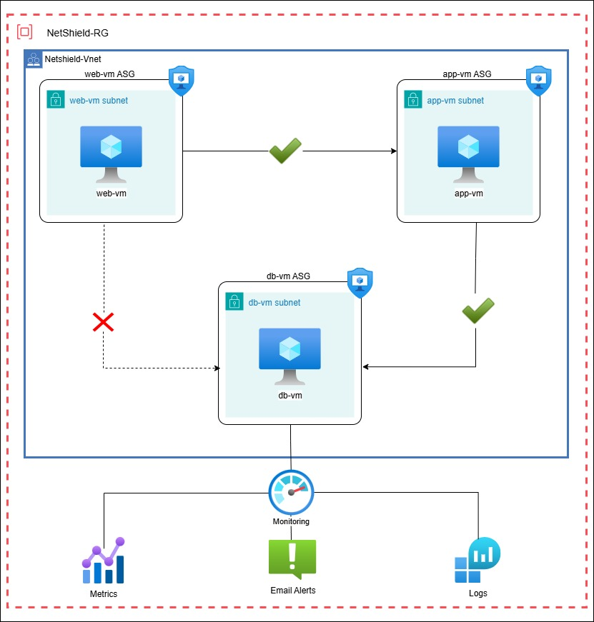

# Azure_multi-tier_security_project
Azure project showcasing a secure multi-tier architecture using NSG, ASG, and VM segmentation.

This project demonstrates a **3-tier secure architecture** in Microsoft Azure using **Network Security Groups (NSG)** and **Application Security Groups (ASG)** for traffic control, monitoring, and alerting.

---

## Architecture Overview

- **Web Tier:** Public-facing Ubuntu VM hosting frontend traffic
- **App Tier:** Internal VM serving application logic on port 8080
- **DB Tier:** Internal-only VM (planned for database), protected by strict rules

---
## Azure Architecture Diagram

## Tech Stack & Services

| Component            | Details                      |
|---------------------|------------------------------|
| Cloud               | Microsoft Azure              |
| Compute             | 3x Ubuntu VMs (Web, App, DB) |
| Networking          | VNets, Subnets, NSG, ASG     |
| Monitoring          | Azure Monitor, Log Analytics |
| Alerting            | Email Alerts via Action Group|
| Scripting/Testing   | Python HTTP server, `curl`, `stress`|
| Logs & Queries      | Kusto Query Language (KQL)   |

---

## Project Steps

### 1. Resource Setup
- Created 1 Resource Group
- Deployed a VNet with 3 subnets: `web-subnet`, `app-subnet`, `db-subnet`
- Deployed 3 Ubuntu VMs (1 per subnet)

### 2. ASG & NSG Configuration
- Created ASGs: `WebASG`, `AppASG`, `DBASG`
- Assigned ASGs to each VM’s NIC
- Created NSG Rules:
  - Allow `WebASG` → `AppASG` (port 8080)
  - Allow `AppASG` → `DBASG` (port 1433)
  - Deny `WebASG` direct access to `DBASG`

### 3. Testing & Validation
- Hosted a Python HTTP server on `app-vm` (`port 8080`)
- Verified connection from `web-vm` using `curl`
- Confirmed denied access from `web-vm` to `db-vm`
- Used `netcat` to simulate DB port test (1433)

### 4. Monitoring & Alerting
- Installed `stress` tool to simulate high CPU on `db-vm`
- Configured Azure Alert:
  - **Condition:** CPU > 60%
  - **Action:** Send email to Gmail
- Verified alert email received
- Monitored live metrics: CPU, Disk I/O

## Key Learnings
ASG-based security is more scalable than IP-based NSG rules

Azure Monitor can be integrated with alerts, email, and KQL for visibility

Multi-tier architecture segmentation improves security and organization
